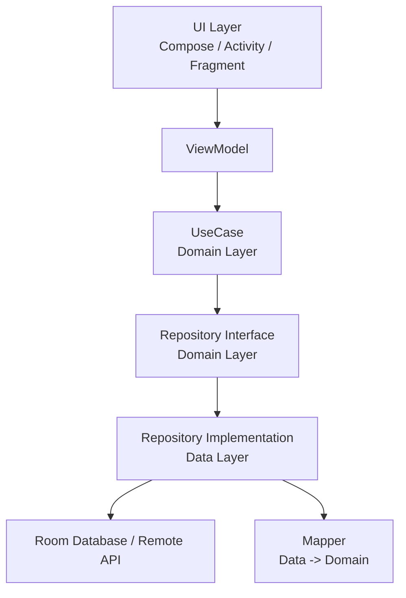

# 📝 Todo App

**Clean Architecture + MVVM + Jetpack Compose**를 사용한 Android Todo App

## ✨ 주요 기능

- ✅ **할 일 관리**: 추가, 수정, 삭제, 완료 처리
- 📱 **반응형 UI**: 실시간 데이터 업데이트
- 💾 **로컬 저장소**: Room을 이용한 오프라인 데이터 저장
- 🔄 **상태 관리**: StateFlow를 이용한 반응형 상태 관리

## 🏗️ 아키텍처

이 프로젝트는 **Clean Architecture** 패턴을 기반으로 구성되어 있습니다.

```
📦 app
├── 🎯 domain/               # 비즈니스 로직 계층
│   ├── entity/             # 도메인 모델
│   ├── repository/         # Repository 인터페이스
│   └── usecase/           # Use Cases
├── 💾 data/                # 데이터 계층
│   ├── local/          # Room Database
│   │   ├── dao/          # Data Access Object
│   │   └── TodoDatabase.kt
│   ├── model/           # Database Model
│   ├── mapper/           # Entity ↔ Domain 변환
│   └── repository/       # Repository 구현체
├── 🎨 presentation/        # 프레젠테이션 계층
│   ├── viewmodel/        # ViewModels
│   ├── state/           # UI States
│   ├── event/           # UI Events
│   └── ui/              # Compose UI
└── 🔧 di/                 # 의존성 주입
```

### 📐 아키텍처 다이어그램



## 🛠️ 기술 스택

### **코어 기술**
- **언어**: [Kotlin](https://kotlinlang.org/) 2.2.10
- **빌드 도구**: [Gradle](https://gradle.org/) with Version Catalog
- **어노테이션 처리**: [KSP](https://github.com/google/ksp) (Kotlin Symbol Processing)

### **아키텍처 패턴**
- **🏗️ Clean Architecture**: 계층 분리를 통한 관심사 분리
- **🎯 MVVM**: Model-View-ViewModel 패턴
- **🔄 Repository Pattern**: 데이터 소스 추상화
- **⚡ Use Case Pattern**: 단일 책임 비즈니스 로직

### **UI & 상태 관리**
- **[Jetpack Compose](https://developer.android.com/jetpack/compose)**: 선언적 UI 프레임워크
- **[Material Design 3](https://m3.material.io/)**: 최신 디자인 시스템
- **[Navigation Compose](https://developer.android.com/jetpack/compose/navigation)**: 화면 간 네비게이션
- **[StateFlow](https://kotlinlang.org/api/kotlinx.coroutines/kotlinx-coroutines-core/kotlinx.coroutines.flow/-state-flow/)**: 반응형 상태 관리

### **데이터베이스**
- **[Room](https://developer.android.com/jetpack/androidx/releases/room)** 2.7.2: SQLite 추상화 라이브러리
- **[Coroutines](https://kotlinlang.org/docs/coroutines-overview.html)** 1.10.2: 비동기 처리

### **의존성 주입**
- **[Hilt](https://dagger.dev/hilt/)** 2.57.1: Android를 위한 DI 프레임워크

## 📦 주요 의존성

```toml
[versions]
agp = "8.12.1"
kotlin = "2.2.10"
hiltAndroid = "2.57.1"
composeBom = "2025.08.01"
roomRuntime = "2.7.2"
kotlinxCoroutinesAndroid = "1.10.2"

[libraries]
# Compose
androidx-compose-bom = { group = "androidx.compose", name = "compose-bom", version.ref = "composeBom" }
androidx-material3 = { group = "androidx.compose.material3", name = "material3" }

# Room
androidx-room-runtime = { group = "androidx.room", name = "room-runtime", version.ref = "roomRuntime" }
androidx-room-compiler = { group = "androidx.room", name = "room-compiler", version.ref = "roomRuntime" }

# Hilt
hilt-android = { group = "com.google.dagger", name = "hilt-android", version.ref = "hiltAndroid" }
hilt-compiler = { group = "com.google.dagger", name = "hilt-compiler", version.ref = "hiltAndroid" }
```

## 🎯 핵심 개념

### Clean Architecture 계층

#### 🎨 **Presentation Layer**
```kotlin
@HiltViewModel
class TodoListViewModel @Inject constructor(
    private val getAllTodosUseCase: GetAllTodosUseCase
) : ViewModel() {
    
    private val _state = MutableStateFlow(TodoListState())
    val state: StateFlow<TodoListState> = _state.asStateFlow()
    
    // UI 이벤트 처리
    fun onEvent(event: TodoListEvent) { ... }
}
```

#### 🎯 **Domain Layer**
```kotlin
// 비즈니스 로직
class GetAllTodosUseCase @Inject constructor(
    private val repository: TodoRepository
) {
    suspend operator fun invoke(): Flow<List<Todo>> {
        return repository.getAllTodos()
    }
}
```

#### 💾 **Data Layer**
```kotlin
// 데이터 소스 구현
class TodoRepositoryImpl @Inject constructor(
    private val dao: TodoDao
) : TodoRepository {
    
    override suspend fun getAllTodos(): Flow<List<Todo>> {
        return dao.getAllTodos().map { entities ->
            TodoMapper.run { entities.toDomainList() }
        }
    }
}
```

### 의존성 주입 (Hilt)

```kotlin
@Module
@InstallIn(SingletonComponent::class)
object DatabaseModule {
    
    @Provides
    @Singleton
    fun provideDatabase(@ApplicationContext context: Context): TodoDatabase {
        return Room.databaseBuilder(
            context,
            TodoDatabase::class.java,
            "todo_database"
        ).build()
    }
}
```

### 상태 관리 (StateFlow)

```kotlin
@Composable
fun TodoListScreen(
    viewModel: TodoListViewModel = hiltViewModel()
) {
    val state by viewModel.state.collectAsState()
    
    // 상태에 따른 UI 렌더링
    when {
        state.isLoading -> LoadingScreen()
        state.todos.isEmpty() -> EmptyScreen()
        else -> TodoList(todos = state.todos)
    }
}
```

## 📈 성능 최적화

- **🚀 KSP**: KAPT 대비 2-3배 빠른 어노테이션 처리
- **⚡ StateFlow**: LiveData보다 효율적인 상태 관리
- **🔄 Room**: 컴파일 타임 SQL 검증으로 런타임 오류 방지
- **🎯 Compose**: 선언적 UI로 효율적인 리컴포지션
